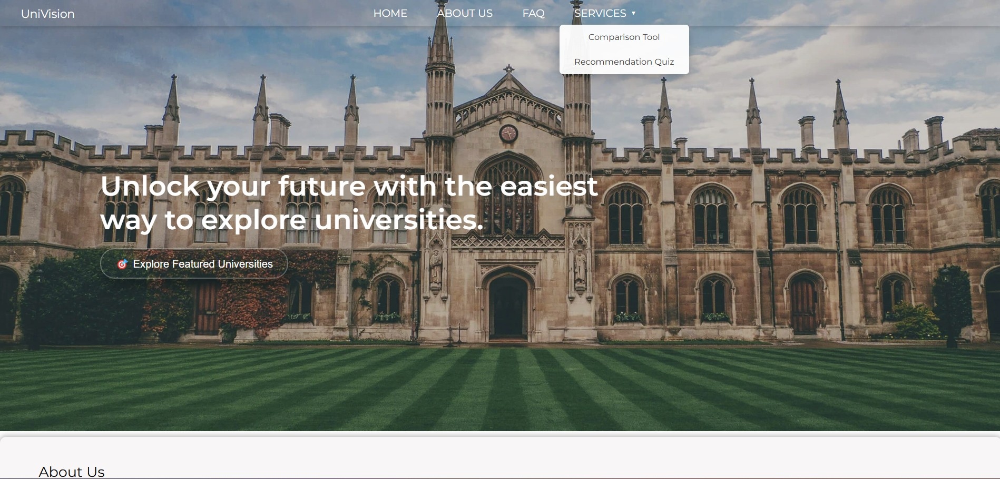
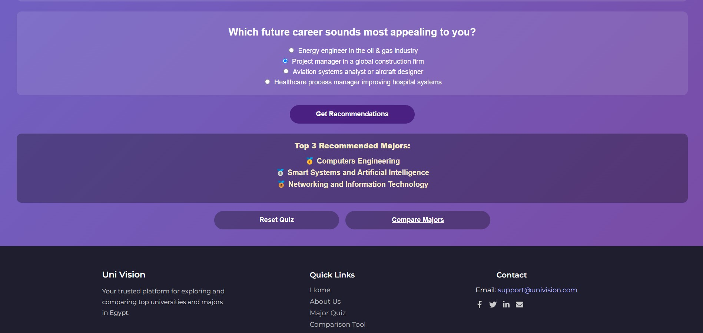
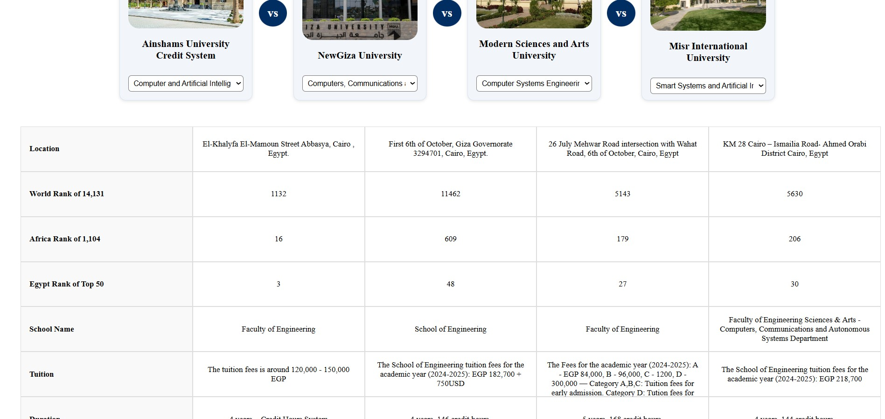
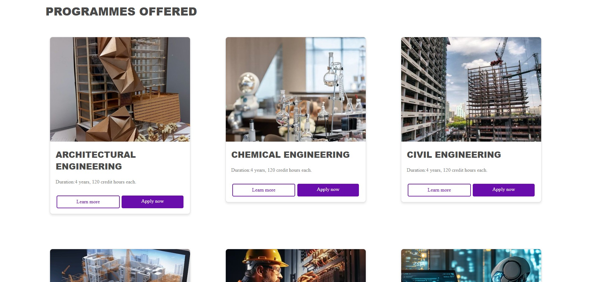

# Universities Hub (MERN)

A full-stack web platform that helps students explore Egyptian universities and majors with trusted program information, side-by-side comparisons, and a recommendation quiz. Built with the MERN stack for a responsive, scalable experience.

> Originally developed during my BSc (2025). Published and polished in 2026 with improved documentation and reproducibility.

## Screenshots




## Demo Video
🎥 Google Drive demo: 
https://drive.google.com/file/d/10BtkUTu0gh8Qgtp3w-8KA-zUvyY9io6O/view?usp=sharing

## Features
- Browse universities and academic programs with structured details
- University/program comparison (side-by-side)
- Recommendation quiz that suggests suitable majors based on interests/personality
- Program content details (study plan, credit distribution, requirements, career paths)
- Responsive UI and clean component-based frontend

## Tech Stack
- **Frontend:** React + Vite
- **Backend:** Node.js + Express
- **Database:** MongoDB (Mongoose)
- **Auth/DB services:** Firebase (if used in this project)
- **Other:** REST APIs, environment-based configuration

## Project Structure
universities-hub/
backend/ # Express API + Mongoose models + routes
frontend/ # React (Vite) client
package.json # root scripts (if used)

## Getting Started

### Prerequisites
- Node.js (LTS recommended)
- npm
- MongoDB (local or MongoDB Atlas)

### 1) Backend setup
```bash
cd backend
npm install

Create a .env file inside backend/ (do NOT commit it):
MONGO_URI=your_mongodb_connection_string
PORT=5000

Run the backend:
npm start
(or npm run dev if you have nodemon configured)
Backend will run on something like:
http://localhost:5000

2) Frontend setup
Open a second terminal:
cd frontend
npm install
npm run dev

Frontend will run on:
http://localhost:5173
 (Vite default)
API Overview (Backend)
Routes (based on current repo structure):
/universities
/programs
/questions
See exact endpoints inside backend/routes/
